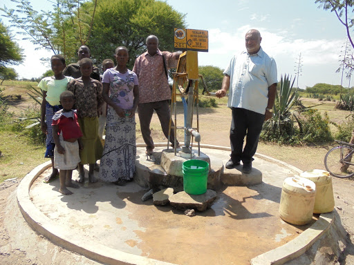

k# Tanzania Water Well Classification Project

Within this repo, I will be utilizing machine learning classification to
predict working water wells in tanzania.

## Contents

1. [Data Transformation & Cleaning]()
2. [Exploratory Data Analysis]()
3. [Data Modeling]()

My Socials:

- Email: paulaleksis@gmail.com
- [Linkedin](https://www.linkedin.com/in/paul-aleksis-406776199/)
- [Medium](https://paulaleksis.medium.com/)

### Executive Summary 

### Model Results

### Methodology

### Sources:

